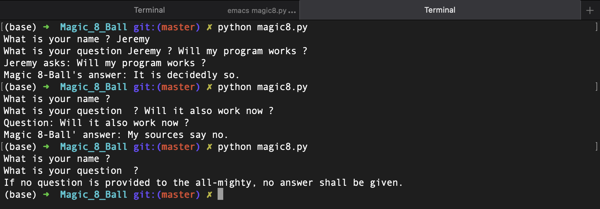

# Magic 8-Ball

### What does it do ?
> Reads your future (not really).

### Renders like this:
> 

### How should i use it ?
> Enter your name, your question.
> If you don't enter your name, it will simply output your question, and give your an answer
> If you enter your name, but no question, no answer will be given :(
> If you enter neither one of them, no answer will be given too ...